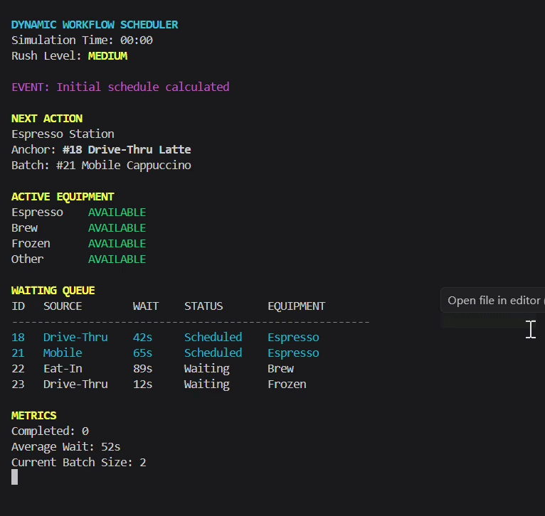

# Dynamic Workflow Scheduler

A real-time C++ workflow scheduler that reduces worker decision latency by prioritizing competing orders, batching compatible tasks, and exposing the next best action through a live terminal interface.

## Problem Statement

High-volume service workers often receive several order streams at once, including drive-thru, mobile, and in-store orders. During a rush, workers must continuously:

- Decide which order is most urgent
- Track how long each customer has waited
- Recognize tasks that share preparation steps
- Monitor equipment availability
- Remember which orders are waiting, active, or complete
- Reorganize the workflow whenever conditions change

The bottleneck is not always the physical speed of preparation. It can also be the cognitive overhead created by repeatedly sorting information and deciding what should happen next.

The Dynamic Workflow Scheduler treats this workflow as a real-time scheduling problem rather than a simple first-in, first-out queue.

## System Overview

Each incoming order is represented as structured data containing its source, timestamp, preparation process, estimated duration, and lifecycle state.

The scheduler:

1. Calculates the urgency of each waiting order.
2. Selects the highest-urgency order as the anchor.
3. Searches for compatible orders that share its preparation process.
4. Protects more urgent work from being displaced by batching.
5. Tracks equipment availability.
6. Recommends the next action.
7. Refreshes a color-coded terminal dashboard when the system state changes.

The project includes both a repeatable simulation environment and an interactive manual-control mode.

## Demo

Add the project GIF to the repository at:

```text
docs/images/live-scheduler-demo.gif
```

Then GitHub will display it here:



The demonstration shows the scheduler recalculating priorities, starting and completing batches, tracking equipment status, and updating queue metrics in real time.

## Features

### Scheduling Engine

- Dynamic urgency scoring
- Aging to reduce starvation
- Deterministic priority tie-breaking
- Highest-urgency anchor selection
- Process-aware compatibility scoring
- Maximum batch-size enforcement
- Priority-inversion protection
- Structured scheduling recommendations

### Order Management

- Drive-thru, mobile, and eat-in order sources
- Waiting, in-progress, complete, and cancelled states
- Duplicate order ID rejection
- Safe lifecycle-transition validation
- Order lookup by ID
- Manual order creation and control

### Equipment and Simulation

- Espresso, brew, frozen, and other equipment categories
- Simulated equipment availability
- Concurrent operation across different stations
- Normal-demand and rush-demand order generation
- Repeatable random scenarios using fixed seeds
- FIFO and dynamic-batching strategy comparison
- Average wait, maximum wait, throughput, and equipment-operation metrics

### Terminal Interface

- Live terminal refresh
- ANSI color output
- Simulation timer
- Rush-level indicator
- Latest-event display
- Next-action recommendation
- Anchor and batch display
- Equipment status display
- Waiting and in-progress queue table
- Completed-order and wait-time metrics

### Interactive Commands

```text
add
start <id>
complete <id>
cancel <id>
find <id>
pause
resume
help
quit
```

The program separates its automated demonstration and manual command modes.

## Architecture

```text
                             +----------------------+
                             |       main.cpp       |
                             | system coordination  |
                             +----------+-----------+
                                        |
         +------------------------------+------------------------------+
         |                              |                              |
         v                              v                              v
+------------------+          +------------------+          +------------------+
| CommandProcessor |          | TerminalDisplay  |          | SimulationRunner |
| parses commands  |          | live dashboard   |          | strategy testing |
+--------+---------+          +--------+---------+          +--------+---------+
         |                             |                             |
         +-----------------------------+-----------------------------+
                                       |
                     +-----------------+-----------------+
                     |                                   |
                     v                                   v
             +---------------+                   +------------------+
             | QueueManager  |                   | EquipmentManager |
             | owns orders   |                   | station state    |
             +-------+-------+                   +--------+---------+
                     |                                    |
                     +----------------+-------------------+
                                      |
                                      v
                              +---------------+
                              |   Scheduler   |
                              | urgency and   |
                              | batch policy  |
                              +-------+-------+
                                      |
                                      v
                                  +-------+
                                  | Order |
                                  +-------+

OrderGenerator supplies randomized normal-demand and rush-demand streams.
```

## Core Components

### `Order`

Represents one customer order.

```cpp
struct Order {
    int id;
    std::string drink;
    std::string size;
    bool hot;
    Source source;
    std::time_t placedAt;
    std::string buildKey;
    Status status = Status::Waiting;
    int estimatedPrepSeconds = 0;
};
```

### `QueueManager`

Owns the order collection and enforces lifecycle operations.

Responsibilities include:

- Adding and removing orders
- Rejecting duplicate IDs
- Finding orders
- Starting, completing, and cancelling orders
- Returning waiting and active order views
- Counting completed orders
- Passing orders to the scheduler for prioritization

### `Scheduler`

Contains the core scheduling policy.

Responsibilities include:

- Urgency calculation
- Dynamic sorting
- Deterministic tie-breaking
- Compatibility scoring
- Batch eligibility
- Anchor selection
- Batch-candidate ranking
- Structured scheduling decisions

### `TerminalDisplay`

Renders the current system state, recommendation, queue, equipment availability, and metrics.

### `CommandProcessor`

Parses manual commands and routes valid actions to `QueueManager`.

### `OrderGenerator`

Generates repeatable order streams under normal and rush demand.

### `EquipmentManager`

Tracks the availability and busy duration of preparation stations.

### `SimulationRunner`

Runs controlled comparisons between FIFO and dynamic batching using the same order stream.

## Scheduling Algorithm

### Urgency

Each waiting order receives an urgency score:

```text
urgency = source rate × seconds waiting
```

Initial source rates:

| Source | Rate |
| --- | ---: |
| Drive-Thru | 1.0 |
| Mobile | 0.6 |
| Eat-In | 0.4 |

Drive-thru urgency grows faster, reflecting its greater time sensitivity. However, all orders continue accumulating urgency, so an older mobile or eat-in order can eventually overtake a newer drive-thru order.

Example:

```text
Eat-In:     0.4 × 200 seconds = 80
Drive-Thru: 1.0 × 30 seconds  = 30
```

The older eat-in order is selected because its urgency is higher.

### Tie-Breaking

When two orders have equal urgency, the scheduler uses:

1. Earlier placement time
2. Lower order ID

This ensures deterministic behavior.

### Batch Selection

The scheduler:

1. Filters to waiting orders.
2. Selects the highest-urgency order as the anchor.
3. Searches for candidates with the same `buildKey`.
4. Rejects candidates that would violate priority rules.
5. Ranks compatible candidates.
6. Adds candidates until the maximum batch size is reached.

The default maximum batch size is three total orders:

```text
1 anchor
2 compatible candidates
```

## `buildKey`

`buildKey` represents the primary preparation process or equipment group required by an order.

Current values:

| `buildKey` | Equipment or process |
| --- | --- |
| `espresso` | Espresso station |
| `brew` | Brew station |
| `frozen` | Frozen-drink station |
| `other` | Other preparation |

Examples:

```text
Latte          -> espresso
Cappuccino     -> espresso
Coffee         -> brew
Frozen Matcha  -> frozen
```

Two orders with different build keys cannot batch.

### Compatibility Score

```text
Same buildKey:     +40
Same temperature:  +10
Same drink:        +10
```

| Match | Score |
| --- | ---: |
| Different process | 0 |
| Same process | 40 |
| Same process and temperature | 50 |
| Same process, temperature, and drink | 60 |

Candidates are ranked by:

1. Higher compatibility score
2. Higher urgency
3. Lower order ID

A candidate is rejected when:

- It has a different `buildKey`
- It is not waiting
- It is the anchor itself
- It is more urgent than the anchor
- Its urgency gap is above the permitted threshold

Batching fills around the priority system rather than replacing it.

## Order State Machine

```text
                       start
              +----------------------+
              |                      v
         +---------+            +------------+
         | Waiting |            | InProgress |
         +----+----+            +------+-----+
              |                        |
      cancel  |                        | complete
              v                        v
        +-----------+            +----------+
        | Cancelled |            | Complete |
        +-----------+            +----------+

InProgress can also transition to Cancelled.
Complete and Cancelled are terminal states.
```

Valid transitions:

```text
Waiting -> InProgress
InProgress -> Complete
Waiting -> Cancelled
InProgress -> Cancelled
```

Invalid transitions are rejected safely.

## Program Modes

At launch, the user can select:

```text
1. Live demonstration
2. Manual command mode
3. Quit
```

### Live Demonstration

The demonstration:

- Loads sample orders
- Calculates the schedule
- Adds a new order
- Starts the recommended batch
- Marks its equipment busy
- Completes the batch
- Recalculates the schedule
- Refreshes the terminal after each event

### Manual Command Mode

Example:

```text
> add
Drink name: Latte
Size (S/M/L): M
Temperature (hot/iced): hot
Source (drive/mobile/eatin): drive
Equipment (espresso/brew/frozen/other): espresso
Estimated preparation seconds: 90

> find 1
> start 1
> complete 1
> quit
```

While paused, commands that change scheduler state are blocked. Lookup, help, resume, and quit remain available.

## Build Instructions

### Requirements

- C++17-compatible compiler
- GCC, MinGW, Clang, or MSVC
- CMake 3.20 or newer for the CMake workflow
- Terminal with ANSI-color support

### Compile the Interactive Program

```bash
g++ -std=c++17 -Wall -Wextra -Wpedantic \
    main.cpp \
    Order.cpp \
    QueueManager.cpp \
    Scheduler.cpp \
    TerminalDisplay.cpp \
    CommandProcessor.cpp \
    -o scheduler.exe
```

On Windows PowerShell, the command may be entered on one line:

```powershell
g++ -std=c++17 -Wall -Wextra -Wpedantic main.cpp Order.cpp QueueManager.cpp Scheduler.cpp TerminalDisplay.cpp CommandProcessor.cpp -o scheduler.exe
```

### Compile the Full Simulation Build

```powershell
g++ -std=c++17 -Wall -Wextra -Wpedantic main.cpp Order.cpp QueueManager.cpp Scheduler.cpp TerminalDisplay.cpp CommandProcessor.cpp OrderGenerator.cpp EquipmentManager.cpp SimulationRunner.cpp -o scheduler.exe
```

### Build with CMake

```powershell
cmake -S . -B build
cmake --build build
```

### Compile the Tests

```powershell
g++ -std=c++17 -Wall -Wextra -Wpedantic test_scheduler.cpp Order.cpp QueueManager.cpp Scheduler.cpp -o scheduler_tests.exe
```

## Run Instructions

### Windows

```powershell
.\scheduler.exe
```

### Linux or macOS

```bash
./scheduler
```

### Run Tests

```powershell
.\scheduler_tests.exe
```

### Run a Repeatable Simulation

```powershell
.\scheduler.exe --seed 42
```

A different seed produces a different order stream:

```powershell
.\scheduler.exe --seed 100
```

## Example Terminal Output

```text
DYNAMIC WORKFLOW SCHEDULER
Simulation Time: 00:04
Rush Level: LOW

EVENT: Batch completed: 2 order(s); schedule recalculated

NEXT ACTION
Brewing Station
Anchor: #22 Eat-In Coffee
Batch: None

ACTIVE EQUIPMENT
Espresso    AVAILABLE
Brew        AVAILABLE
Frozen      AVAILABLE
Other       AVAILABLE

WAITING QUEUE
ID   SOURCE        WAIT    STATUS       EQUIPMENT
--------------------------------------------------------
22   Eat-In        93s     Scheduled    Brew
23   Drive-Thru    16s     Waiting      Frozen
24   Drive-Thru    3s      Waiting      Espresso

METRICS
Completed: 2
Average Wait: 37s
Current Batch Size: 1
```

ANSI colors highlight the title, rush level, event messages, equipment state, and scheduled orders during execution.

## Simulation Methodology

The simulation compares FIFO and dynamic batching using the same generated rush-demand order stream.

### Controlled Inputs

- Fixed random seed
- Identical orders for both strategies
- Same arrival times
- Same estimated preparation times
- Same equipment categories
- Same simulated time scale

### FIFO Strategy

FIFO selects the oldest eligible order for each available equipment station. It does not combine compatible orders.

### Dynamic Batching Strategy

Dynamic scheduling:

1. Selects the highest-urgency eligible order.
2. Checks the required equipment.
3. Searches for compatible waiting orders.
4. Pulls qualified candidates into a batch.
5. Protects higher-urgency work from displacement.
6. Models shared preparation time.

### Batch-Time Assumption

```text
batch duration =
longest individual preparation duration
+ one tick per additional order
```

This models shared setup and partially overlapping work. It is an initial simulation assumption, not a measured production value.

### Measured Metrics

- Orders completed
- Total simulation ticks
- Average wait
- Maximum wait
- Equipment operations
- Orders incorporated into batches

## Measured Results

A fixed-seed rush scenario generated 20 orders and passed the identical stream through both strategies.

| Metric | FIFO | Dynamic | Change |
| --- | ---: | ---: | ---: |
| Orders completed | 20 | 20 | No change |
| Total simulation time | 78 ticks | 59 ticks | 19 fewer ticks |
| Average wait | 17.80 ticks | 12.35 ticks | 5.45 fewer ticks |
| Maximum wait | 57 ticks | 45 ticks | 12 fewer ticks |
| Equipment operations | 20 | 13 | 7 fewer operations |
| Orders batched | 0 | 7 | 7 additional orders |

Within the current simulation model, dynamic scheduling produced approximately:

- 31% lower average wait
- 21% lower maximum wait
- 24% shorter total simulation time
- 35% fewer equipment operations

These results demonstrate improvement under the current assumptions. They do not represent measured performance in a real store.

## Testing

The test suite covers:

- Source urgency rates
- Aging and starvation prevention
- Empty queues
- Future timestamps
- Invalid source values
- Deterministic tie-breaking
- Compatibility scoring
- Batch eligibility
- Priority-inversion protection
- Batch-size limits
- Empty scheduling decisions
- Completed-order exclusion
- Cancelled-order exclusion
- In-progress-order exclusion
- Duplicate ID rejection
- Valid lifecycle transitions
- Invalid lifecycle-transition rejection

The interactive mode has also been manually tested using:

```text
add -> find -> start -> complete -> quit
```

## Embedded Extension

The proposed STM32 extension keeps the embedded scope intentionally small.

The first hardware prototype would:

1. Read three equipment-status buttons or sensors.
2. Track espresso, brew, and frozen station availability.
3. Send state changes to the desktop scheduler through UART.
4. Allow the scheduler to avoid assigning orders to unavailable equipment.

Example UART messages:

```text
ESPRESSO:AVAILABLE
BREW:BUSY
FROZEN:AVAILABLE
```

### Hardware/Software Boundary

The STM32 handles:

- GPIO inputs
- Input debouncing
- Equipment-state tracking
- UART message formatting
- Hardware communication

The desktop C++ application handles:

- Serial parsing
- Equipment-state updates
- Queue management
- Urgency scoring
- Batch selection
- Terminal visualization
- Metrics

Full design details are documented in:

[`docs/embedded-extension.md`](docs/embedded-extension.md)

## Technologies Used

- C++17
- Object-oriented programming
- Standard Template Library
- Vectors and sorting algorithms
- Finite-state-machine design
- Scheduling algorithms
- Discrete-event simulation
- UART architecture
- STM32 extension planning
- ANSI terminal control
- CMake
- GCC / MinGW
- GDB
- Git
- GitHub

## Current Limitations

- The manual and randomized simulation modes are separate.
- The live demonstration uses simplified timing.
- Equipment timing uses fixed or estimated durations.
- Batch savings rely on an initial simulation assumption.
- The program has no persistent order history.
- Completed orders are not automatically archived.
- Manual mode is terminal-based rather than graphical.
- Random arrivals are not yet integrated into the live dashboard.
- Manual commands and automatic equipment timers are not fully unified.
- Source urgency rates are initial assumptions.
- Compatibility weights are initial assumptions.
- Simulation parameters have not been calibrated with store data.
- Worker availability and parallel worker capacity are not modeled.
- Machine failures and cleaning delays are not modeled.
- Drink modifiers and inventory constraints are not modeled.
- Physical equipment data is not yet connected.
- The project is not a production-ready point-of-sale system.

## Milestone Roadmap

### Completed

- [x] Identify the workflow bottleneck
- [x] Define the order model
- [x] Implement queue management
- [x] Implement dynamic urgency scoring
- [x] Add aging to reduce starvation
- [x] Add deterministic tie-breaking
- [x] Implement process-aware compatibility scoring
- [x] Implement batch selection
- [x] Enforce lifecycle transitions
- [x] Reject duplicate order IDs
- [x] Build a randomized order generator
- [x] Model equipment availability
- [x] Implement FIFO simulation
- [x] Implement dynamic-batching simulation
- [x] Measure wait time and equipment operations
- [x] Add fixed-seed simulation support
- [x] Add automated tests
- [x] Add live terminal visualization
- [x] Add terminal colors
- [x] Display scheduling recommendations
- [x] Display equipment state and queue metrics
- [x] Add manual command mode
- [x] Add `add`, `find`, `start`, `complete`, and `cancel`
- [x] Add pause and resume controls
- [x] Define the STM32 extension
- [x] Document the hardware/software boundary

### In Progress

- [ ] Add automated command-parser tests
- [ ] Add simulation-specific tests
- [ ] Compare results across multiple random seeds
- [ ] Improve manual-input validation
- [ ] Integrate all build targets into CMake
- [ ] Refine scheduling parameters through customer discovery

### Planned

- [ ] Integrate random arrivals into the live dashboard
- [ ] Retry blocked orders automatically
- [ ] Add per-source wait metrics
- [ ] Measure equipment utilization
- [ ] Add automatic order history and archival
- [ ] Model worker capacity
- [ ] Model equipment failures and cleaning
- [ ] Add drink modifiers and inventory constraints
- [ ] Add serial communication with an STM32
- [ ] Add physical equipment-state inputs
- [ ] Create a graphical interface
- [ ] Explore a closed-loop embedded workflow assistant

## Lessons Learned

### The visible bottleneck is not always the real bottleneck

The project began as an idea for automating physical coffee-shop tasks. Observation showed that a larger problem was the repeated mental sorting and reprioritization workers performed during rush periods.

### Priority should change over time

A rigid source hierarchy can starve lower-priority orders. Modeling urgency as a rate allows time-sensitive streams to rise quickly while still allowing old orders to recover priority.

### Batching should support priority, not replace it

Grouping similar work is useful only when it does not create a more serious delay elsewhere. The batching algorithm therefore begins with the highest-urgency anchor and fills around it.

### Simulation makes performance claims testable

Building FIFO and dynamic strategies against the same order stream made it possible to measure the effects of scheduling assumptions rather than relying only on intuition.

### Modular architecture makes hardware extension possible

Separating orders, queue ownership, scheduling, equipment state, presentation, commands, and simulation makes the system easier to test and creates a clear boundary for future STM32 integration.

### Scope control is an engineering decision

A button-based UART prototype can demonstrate embedded architecture without unsafe or premature integration with commercial equipment.

## Project Goal

The long-term goal is to create a workflow-assistance system that reduces cognitive friction rather than replacing workers.

By externalizing routine prioritization, batching, equipment tracking, and task-sequencing decisions, the scheduler is intended to help workers focus on production, communication, and customer service.
